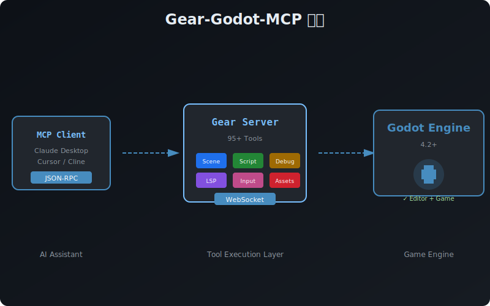
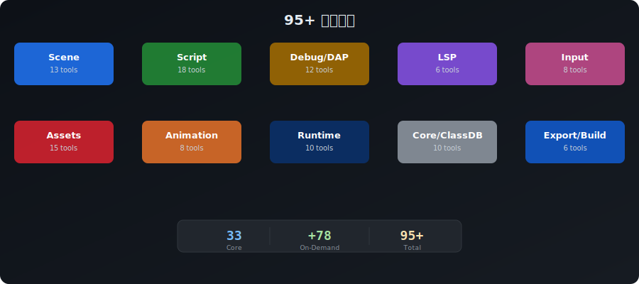
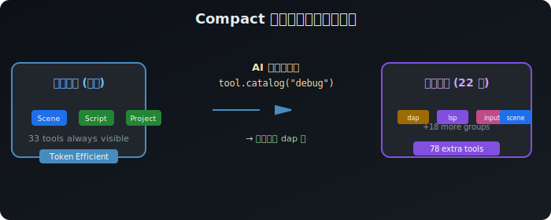

# Gear

[](https://modelcontextprotocol.io/introduction)
[](https://godotengine.org)
[](https://nodejs.org/en/download/)
[](https://www.typescriptlang.org/)
[](https://www.npmjs.com/package/Gear)

[](https://github.com/wvfp/Gear-godot-mcp/commits/main)
[](https://github.com/wvfp/Gear-godot-mcp/stargazers)
[](https://github.com/wvfp/Gear-godot-mcp/network/members)
[](https://opensource.org/licenses/MIT)

🌐 **言語を選択**: [English](README.md) | [한국어](README-ko.md) | [简体中文](README-zh.md) | **日本語** | [Deutsch](README-de.md) | [Português](README-pt_BR.md)


**Godot エンジン向け最も包括的な Model Context Protocol (MCP) サーバー — AI アシスタントが前例のない深さと精度で Godot ゲームを構築、修正、デバッグできます。**

> **オートリロード機能追加！** MCP で外部からシーンやスクリプトを修正すると、Godot エディターが自動的にリフレッシュされます。

---

## なぜ Gear なのか？

### 🚀 ゲーム開発ワークフローの革命







Gear は単なるツールではありません — AI アシスタントがゲームエンジンと対話する方法の**パラダイムシフト**です：

#### 1. **Godot を真に理解する AI**

従来の AI アシスタントは GDScript を書けますが、本質的に目を閉じて作業しているようなものです。訓練データに基づいてコードを生成し、動くことを願うだけです。**Gear はすべてを変えます：**

- **リアルタイムフィードバックループ**：「プロジェクトを実行してエラーを見せて」と言えば、AI が実際にプロジェクトを実行し、出力をキャプチャし、何が問題なのかを正確に確認します
- **コンテキスト対応サポート**：AI が実際のシーンツリーを検査し、ノード階層を理解し、実際のプロジェクト構造に基づいて提案を提供します
- **提案前に検証**：リソースの使用を提案する前に、AI がプロジェクトに存在するかどうかを確認します

#### 2. **動的 ClassDB イントロスペクション付きの 110 以上のツール**

すべての Godot クラスに対してツールをハードコーディングする代わりに、Gear は ANY ClassDB クラスで機能する**汎用ツール**（`add_node`、`create_resource`）と、AI がクラス、プロパティ、メソッドを動的に発見できる **ClassDB イントロスペクションツール**を提供します。

| カテゴリ | できること | ツール |
|---------|-----------|------|
| **シーン管理** | プログラムでシーンツリー全体を構築 | `create_scene`, `add_node`, `delete_node`, `duplicate_node`, `reparent_node`, `list_scene_nodes`, `get_node_properties`, `set_node_properties` |
| **ClassDB イントロスペクション** | Godot クラス、プロパティ、メソッド、シグナルを動的に発見 | `query_classes`, `query_class_info`, `inspect_inheritance` |
| **GDScript 操作** | 精密にスクリプトを作成・修正 | `create_script`, `modify_script`, `get_script_info` |
| **リソース管理** | 任意のリソースタイプを作成、既存リソースを修正 | `create_resource`, `modify_resource`, `create_material`, `create_shader` |
| **アニメーションシステム** | アニメーションとステートマシンを構築 | `create_animation`, `add_animation_track`, `create_animation_tree`, `add_animation_state`, `connect_animation_states` |
| **2D タイルシステム** | タイルセットを作成してタイルマップを埋める | `create_tileset`, `set_tilemap_cells` |
| **シグナル管理** | ゲームのイベントシステムを接続 | `connect_signal`, `disconnect_signal`, `list_connections` |
| **プロジェクト設定** | 設定、オートロード、入力を管理 | `get_project_setting`, `set_project_setting`, `add_autoload`, `add_input_action` |
| **開発者体験** | プロジェクトの分析、デバッグ、メンテナンス | `get_dependencies`, `find_resource_usages`, `parse_error_log`, `get_project_health`, `search_project` |
| **ランタイムデバッグ** | 実行中のゲームを検査・修正 | `inspect_runtime_tree`, `set_runtime_property`, `call_runtime_method`, `get_runtime_metrics` |
| **スクリーンショットキャプチャ** | 実行中のゲームのビューポートをキャプチャ | `capture_screenshot`, `capture_viewport` |
| **入力注入** | キーボード、マウス、アクション入力をシミュレート | `inject_action`, `inject_key`, `inject_mouse_click`, `inject_mouse_motion` |
| **GDScript LSP** | Godot 内蔵言語サーバーを通じた診断、補完、ホバー、シンボル | `lsp_get_diagnostics`, `lsp_get_completions`, `lsp_get_hover`, `lsp_get_symbols` |
| **デバッグアダプター (DAP)** | ブレークポイント、ステップ実行、スタックトレース、デバッグ出力キャプチャ | `dap_get_output`, `dap_set_breakpoint`, `dap_continue`, `dap_step_over`, `dap_get_stack_trace` |
| **MCP リソース** | `godot://` URI 経由でプロジェクトファイルにアクセス | `godot://project/info`, `godot://scene/{path}`, `godot://script/{path}` |
| **オーディオシステム** | オーディオバスを作成、エフェクトを設定 | `create_audio_bus`, `get_audio_buses`, `set_audio_bus_effect`, `set_audio_bus_volume` |
| **ナビゲーション** | AI 経路探索の設定 | `create_navigation_region`, `create_navigation_agent` |
| **UI/テーマ** | シェーダーを使用したカスタムテーマの作成と適用 | `set_theme_color`, `set_theme_font_size`, `apply_theme_shader` |
| **アセットライブラリ** | 複数のソースから CC0 アセットを検索・ダウンロード | `search_assets`, `fetch_asset`, `list_asset_providers` |
| **オートリロード** | 外部変更時にエディターを即時リフレッシュ | 内蔵エディタープラグイン |

#### 動的ツールグループ（compact モード）

`compact` プロファイルでは、33個のコアツールのみ表示され、78個の追加ツールは**22のグループ**に分類されて必要時に自動的にアクティベートされます：

| グループ | ツール数 | 説明 |
|---|---|---|
| `scene_advanced` | 3 | ノードの複製、再親化、スプライトの読み込み |
| `uid` | 2 | リソースUID管理 |
| `import_export` | 5 | インポートパイプライン、再インポート、プロジェクト検証 |
| `autoload` | 4 | オートロードシングルトン、メインシーン |
| `signal` | 2 | シグナル切断、接続一覧 |
| `runtime` | 4 | ライブシーン検査、ランタイムプロパティ、メトリクス |
| `resource` | 4 | マテリアル/シェーダー/リソースの作成・修正 |
| `animation` | 5 | アニメーション、トラック、ステートマシン |
| `plugin` | 3 | エディタープラグイン管理 |
| `input` | 1 | 入力アクションマッピング |
| `tilemap` | 2 | TileSet と TileMap ペインティング |
| `audio` | 4 | オーディオバス、エフェクト、ボリューム |
| `navigation` | 2 | ナビゲーションリージョン/エージェント |
| `theme_ui` | 3 | テーマカラー、フォントサイズ、シェーダー |
| `asset_store` | 3 | CC0アセット検索/ダウンロード |
| `testing` | 6 | スクリーンショット、ビューポートキャプチャ、入力インジェクション |
| `dx_tools` | 4 | エラーログ、プロジェクトヘルス、使用箇所検索 |
| `intent_tracking` | 9 | インテントキャプチャ、意思決定ログ、ハンドオフ |
| `class_advanced` | 1 | クラス継承検査 |
| `lsp` | 3 | GDScript 補完、ホバー、シンボル |
| `dap` | 6 | ブレークポイント、ステッピング、スタックトレース |
| `version_gate` | 2 | バージョン検証、パッチ確認 |

**使い方：**
1. **カタログ自動アクティベーション**: `tool.catalog` で検索すると、マッチするグループが自動的にアクティベートされます。
2. **手動アクティベーション**: `tool.groups` で直接グループをアクティベート/デアクティベートできます。
3. **リセット**: `tool.groups` の `reset` アクションですべてのグループを無効化します。

> **設計哲学**：90 以上の専用ツール（`create_camera`、`create_light`、`create_physics_material` など）を提供する代わりに、Gear は ANY Godot クラスで機能する汎用の `add_node` と `create_resource` ツールを使用します。AI は `query_classes` で利用可能なタイプを発見し、`query_class_info` でプロパティを学習します — 開発者が Godot ドキュメントを使用するように。

#### 3. **オートリロードによるシームレスなエディター統合**

内蔵の**オートリロードプラグイン**が外部編集の摩擦を解消します：

- **手動リフレッシュ不要**：MCP がシーンやスクリプトを修正すると、Godot エディターが自動的にリロード
- **1秒検出**：パフォーマンスへの影響が無視できる軽量ポーリング（~0.01ms/秒）
- **スマート監視**：開いているシーンとその添付スクリプトを監視
- **ゼロ設定**：プラグインを有効にするだけ

```
MCP がファイルを修正 → オートリロードが検出 → エディターがリロード → 即座に結果を確認
```

#### 4. **コピー・貼り付け・デバッグサイクルを排除**

**Gear 導入前：**
1. AI にコードを要求
2. プロジェクトにコードをコピー
3. プロジェクトを実行、エラーが発生
4. AI にエラーをコピーバック
5. 修正を受け取って貼り付け
6. 10 回以上繰り返す

**Gear 導入後：**
1. 「体力、移動、ジャンプ機能付きのプレイヤーキャラクターを作成して」
2. AI がシーンを作成し、スクリプトを書き、ノードを追加し、シグナルを接続してテストする
3. 完了。

AI はコードを書くだけでなく、**機能をエンドツーエンドで実装**します。

#### 5. **型安全でエラーに強い操作**

Gear のすべての操作には以下が含まれます：

- **パス検証**：無効なファイル操作を防止
- **型シリアライゼーション**：Vector2、Vector3、Color、Transform、すべての Godot 型を正しく処理
- **エラー回復**：修正提案付きの意味のあるエラーメッセージ
- **アトミック操作**：変更は一貫して適用されるか、まったく適用されない

#### 6. **プロジェクト健全性インテリジェンス**

`get_project_health` ツールはプロジェクトの包括的な分析を提供します：

```json
{
  "score": 85,
  "grade": "B",
  "checks": {
    "structure": { "passed": true },
    "resources": { "issues": ["テクスチャ 3 つの再インポートが必要"] },
    "scripts": { "issues": ["TODO コメント 5 つ発見"] },
    "config": { "passed": true }
  },
  "recommendations": [
    "ターゲットプラットフォーム用のエクスポートプリセットを設定",
    "リリース前に TODO アイテムを確認・解決"
  ]
}
```

#### 7. **依存関係分析と循環参照の検出**

`get_dependencies` ツール：

- プロジェクトのすべてのリソース依存関係をマッピング
- ランタイムエラーを引き起こす前に循環参照を検出
- 任意のリソースの完全な依存関係チェーンを表示

```
PlayerScene.tscn
├── PlayerScript.gd
│   └── WeaponBase.gd
│       └── ⚠️ 循環参照: PlayerScript.gd
└── PlayerSprite.png
```

#### 8. **ライブランタイムデバッグ（オプションアドオン）**

内蔵の `godot_mcp_runtime` アドオンをインストールすると：

- **ライブシーンツリー検査**：ゲーム実行中に実際のノードツリーを確認
- **ホットプロパティ変更**：再起動なしにリアルタイムで値を変更
- **リモートメソッド呼び出し**：実行中のゲームで関数をトリガー
- **パフォーマンスモニタリング**：FPS、メモリ、描画コールなどを追跡

### 💡 実際のユースケース

#### **ラピッドプロトタイピング**
```
"移動、ジャンプ、コイン収集ができる基本的なプラットフォーマーを作成して"
```
AI がシーン、スクリプト、ノード、シグナル、入力アクションを作成 — 数分でプレイ可能なプロトタイプ完成。

#### **大規模リファクタリング**
```
"古い PlayerData リソースを使用しているすべての箇所を見つけて新しい PlayerStats に更新して"
```
プロジェクト全体を検索し、すべての参照を特定して一貫した変更を適用。

#### **複雑な問題のデバッグ**
```
"プレイヤーが床を突き抜けてしまう。コリジョン設定を確認して何が問題か教えて"
```
ノードプロパティを検査し、シーン構造を分析し、設定の問題を特定。

#### **Godot の学習**
```
"ボタンをクリックするとラベルのテキストが変わる例を作ってシグナルの仕組みを見せて"
```
説明するだけでなく、実際のプロジェクトに動作するサンプルを構築。

#### **大規模プロジェクトのメンテナンス**
```
"プロジェクトの健全性チェックを実行して注意が必要な箇所を教えて"
```
プロジェクト構造、未使用リソース、潜在的な問題についての実用的なインサイトを提供。

---

## 機能

### コア機能
- **Godot エディター起動**：特定のプロジェクトの Godot エディターを開く
- **Godot プロジェクト実行**：デバッグモードで Godot プロジェクトを実行
- **デバッグ出力キャプチャ**：コンソール出力とエラーメッセージを取得
- **実行制御**：プログラムで Godot プロジェクトを開始・停止
- **Godot バージョン取得**：インストールされている Godot バージョンを取得
- **Godot プロジェクト一覧**：指定ディレクトリで Godot プロジェクトを検索
- **プロジェクト分析**：プロジェクト構造の詳細情報を取得

### シーン管理
- 指定したルートノードタイプで新しいシーンを作成
- ノードの追加、削除、複製、親の変更
- 型安全シリアライゼーションでノードプロパティを設定
- 完全な階層構造でシーンツリーを一覧表示
- Sprite2D ノードにスプライトとテクスチャをロード
- GridMap 用 MeshLibrary リソースとして 3D シーンをエクスポート

### GDScript 操作
- **スクリプト作成**：テンプレート（singleton、state_machine、component、resource）で新しい GDScript ファイルを生成
- **スクリプト修正**：既存のスクリプトに関数、変数、シグナルを追加
- **スクリプト分析**：スクリプト構造、依存関係、エクスポートの詳細情報を取得

### シグナルと接続管理
- シーン内のノード間でシグナルを接続
- シグナル接続を切断
- シーン内のすべてのシグナル接続を一覧表示

### ClassDB イントロスペクション（新機能！）
- **クラス照会**：名前、カテゴリ（node、node2d、node3d、control、resource など）、インスタンス可能性でフィルタリングして利用可能な Godot クラスを発見
- **クラス情報照会**：任意のクラスの詳細なメソッド、プロパティ、シグナル、列挙型を取得
- **継承の検査**：クラス階層の探索 — 先祖、子、すべての子孫

### リソース管理
- **リソース作成**：任意のリソースタイプを .tres ファイルとして生成（専用 create_* ツールを置き換え）
- **リソース修正**：既存の .tres/.res ファイルのプロパティを更新
- **マテリアル作成**：StandardMaterial3D、ShaderMaterial、CanvasItemMaterial、ParticleProcessMaterial
- **シェーダー作成**：テンプレート付きの canvas_item、spatial、particles、sky、fog シェーダー

### アニメーションシステム
- AnimationPlayer ノードで新しいアニメーションを作成
- アニメーションにプロパティとメソッドトラックを追加
- 適切な値シリアライゼーションでキーフレームを挿入

### 2D タイルシステム
- アトラステクスチャソースで TileSet リソースを作成
- プログラムで TileMap セルを設定

### インポート/エクスポートパイプライン
- リソースのインポートステータスとオプションを取得
- インポート設定を変更して再インポートをトリガー
- エクスポートプリセットの一覧とエクスポート用プロジェクトの検証
- Godot CLI を使用してプロジェクトをエクスポート

### プロジェクト設定
- プロジェクト設定の取得と設定
- オートロードシングルトンの管理（追加、削除、一覧）
- メインシーンの設定
- キー、マウス、ジョイパッドイベントで入力アクションを追加

### プラグイン管理
- インストール済みプラグインをステータス付きで一覧表示
- プラグインの有効化と無効化

### 開発者体験
- **依存関係分析**：循環参照検出付きのリソース依存グラフを取得
- **リソース使用検索器**：プロジェクト全体でリソースのすべての使用を検索
- **エラーログパーサー**：提案付きで Godot エラーログを解析
- **プロジェクト健全性チェック**：スコアリング付きの包括的なプロジェクト分析
- **プロジェクト検索**：すべてのプロジェクトファイルでテキスト/パターンを検索

---

## 要件

- システムに [Godot Engine 4.x](https://godotengine.org/download) をインストール
- Node.js 18+ と npm
- MCP をサポートする AI アシスタント（Claude Desktop、Cline、Cursor、OpenCode など）

---

## インストールと設定

### 🚀 ワンクリックインストール（推奨）

**Linux / macOS**
```bash
curl -sL https://raw.githubusercontent.com/wvfp/Gear-godot-mcp/main/install.sh | bash
```

このスクリプトは：
- ✅ 前提条件を確認（Git、Node.js 18+、npm）
- ✅ `~/.local/share/godot-mcp` にリポジトリをクローン
- ✅ 依存関係を自動インストールしてビルド
- ✅ Godot インストールを自動検出
- ✅ AI アシスタントの設定手順を表示

---

### npm でインストール（最速）

```bash
npx Gear
```

またはグローバルインストール：
```bash
npm install -g Gear
Gear
```

---

### 手動インストール

#### ステップ 1：インストールとビルド

```bash
git clone https://github.com/wvfp/Gear-godot-mcp.git
cd godot-mcp
npm install
npm run build
```

#### ステップ 2：AI アシスタントと設定

**Cline (VS Code)：**
```json
{
  "mcpServers": {
    "godot": {
      "command": "node",
      "args": ["/absolute/path/to/godot-mcp/build/index.js"],
      "env": {
        "GODOT_PATH": "/path/to/godot",
        "DEBUG": "true"
      },
      "disabled": false
    }
  }
}
```

**Claude Desktop：**
```json
{
  "mcpServers": {
    "godot": {
      "command": "node",
      "args": ["/absolute/path/to/godot-mcp/build/index.js"],
      "env": {
        "GODOT_PATH": "/path/to/godot"
      }
    }
  }
}
```

**OpenCode：**
```json
{
  "mcp": {
    "godot": {
      "type": "local",
      "command": ["node", "/absolute/path/to/godot-mcp/build/index.js"],
      "enabled": true,
      "environment": {
        "GODOT_PATH": "/path/to/godot"
      }
    }
  }
}
```

### ステップ 3：環境変数

| 変数 | 説明 |
|------|------|
| `GODOT_PATH` | Godot 実行ファイルのパス（未設定時は自動検出） |
| `DEBUG` | 詳細ログを有効にするには "true" に設定 |

---

## プロンプト例

設定後、自然言語で Godot を操作できます：

### シーン構築
```
"CharacterBody2D ルートノードで Player という新しいシーンを作成して"
"Player シーンに Sprite2D と CollisionShape2D を追加して"
"Enemy ノードを複製して Enemy2 と名前を付けて"
```

### スクリプト操作
```
"移動とジャンプのある GDScript をプレイヤー用に作成して"
"プレイヤースクリプトに health_changed シグナルを発火する take_damage 関数を追加して"
"PlayerController スクリプトの構造を表示して"
```

### リソース管理
```
"敵用の赤い StandardMaterial3D を作成して"
"ディゾルブエフェクトの canvas_item シェーダーを作成して"
"tilemap_atlas.png から 16x16 タイルの TileSet を生成して"
```

### プロジェクト分析
```
"プロジェクトの健全性を確認して問題を表示して"
"PlayerData リソースを使用しているすべてのファイルを見つけて"
"メインシーンの依存グラフを表示して"
```

### デバッグ
```
"プロジェクトを実行してエラーを表示して"
"Godot エラーログを解析して修正提案をして"
"実行中のゲームのシーンツリーを検査して"
```

---

## 内蔵アドオン

### オートリロードプラグイン（推奨）

**MCP ワークフローに必須** - 外部修正時にシーンとスクリプトを自動でリロード。

**Linux / macOS：**
```bash
# Godot プロジェクトフォルダで実行
curl -sL https://raw.githubusercontent.com/wvfp/Gear-godot-mcp/main/install-addon.sh | bash
```

**手動インストール：**
1. `build/addon/auto_reload` をプロジェクトの `addons/` フォルダにコピー
2. Godot でプロジェクトを開く
3. **Project > Project Settings > Plugins** に移動
4. "Godot MCP Auto Reload" を有効化

**⚠️ 警告**：シーンをエディターで AND 外部から同時に修正すると、エディターの変更が失われます。

---

## アーキテクチャ

Gear はハイブリッドアーキテクチャを使用：

1. **直接 CLI コマンド**：シンプルな操作は Godot の内蔵 CLI を使用
2. **バンドル GDScript**：複雑な操作は ClassDB イントロスペクション付きの包括的な `godot_operations.gd` スクリプトを使用
3. **ランタイムアドオン**：ライブデバッグ、スクリーンショットキャプチャ、入力注入用の TCP サーバー（ポート 7777）
4. **Godot LSP 統合**：GDScript 診断のために Godot エディターの言語サーバー（ポート 6005）に接続
5. **Godot DAP 統合**：ブレークポイントとステップ実行のために Godot のデバッグアダプター（ポート 6006）に接続
6. **MCP リソース**：直接プロジェクトファイルアクセスのための `godot://` URI プロトコル

---

## トラブルシューティング

| 問題 | 解決策 |
|------|-------|
| Godot が見つからない | `GODOT_PATH` 環境変数を設定 |
| 接続の問題 | AI アシスタントを再起動 |
| 無効なプロジェクトパス | パスに `project.godot` が含まれているか確認 |
| ビルドエラー | `npm install` を実行して依存関係をインストール |
| ランタイムツールが動作しない | プロジェクトにアドオンをインストールして有効化 |

---

## コントリビューション

コントリビューション歓迎！ [CONTRIBUTING.md](CONTRIBUTING.md) ガイドをお読みください。

---

## ライセンス

MIT ライセンス - 詳細は [LICENSE](LICENSE) を参照。

---

## 統計

- **110 以上のツール** — シーン管理、スクリプト、リソース、アニメーション、設定、デバッグ、スクリーンショット、入力注入、LSP、DAP、アセット管理を網羅する包括的なツール
- **MCP リソース** — 直接プロジェクトファイルアクセスのための `godot://` URI プロトコル
- **GDScript LSP** — Godot 言語サーバーによるリアルタイム診断、補完、ホバー、シンボル
- **デバッグアダプター (DAP)** — ブレークポイント、ステップ実行、スタックトレース、コンソール出力キャプチャ
- **スクリーンショットキャプチャ** — ランタイムアドオンによる実行中ゲームのビューポートキャプチャ
- **入力注入** — 自動化テスト用のキーボード、マウス、アクションシミュレーション
- **ClassDB イントロスペクション** — AI がハードコードされたツール定義に頼らず Godot クラス、プロパティ、メソッドを動的に発見
- **20,000 行以上**の TypeScript と GDScript
- **約 85% のカバレッジ**の Godot Engine 機能
- **Godot 4.x** 完全サポート（4.4+ UID 機能を含む）
- **オートリロード**プラグインによるシームレスな MCP 統合
- **マルチソースアセットライブラリ** — Poly Haven、AmbientCG、Kenney の CC0 アセット
- **npm パッケージ** — `npx Gear` または `npm install -g Gear` でインストール

---

## クレジット

- オリジナル MCP サーバー：[Coding-Solo](https://github.com/Coding-Solo/godot-mcp)
- オートリロードプラグインと統合パッケージ：[wvfp](https://github.com/wvfp)
