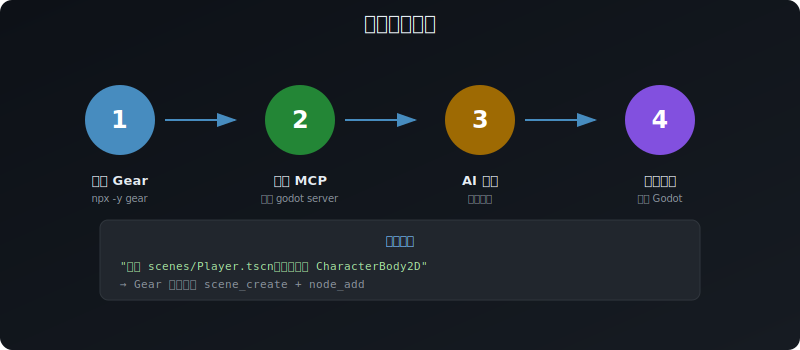

# Gear

[](https://modelcontextprotocol.io/introduction)
[](https://godotengine.org)
[](https://nodejs.org/en/download/)
[](https://www.typescriptlang.org/)
[](https://www.npmjs.com/package/gear-godot-mcp)
[](https://github.com/wvfp/Gear-godot-mcp/stargazers)
[](https://opensource.org/licenses/MIT)

## MCP Server for Godot 4


**Gear 让 AI 助手可以直接运行、检查、修改和调试你的 Godot 项目。**

---

## 架构概览


---

## 快速开始 (3 分钟)

### 环境要求

- Godot 4.x
- Node.js 18+
- 支持 MCP 的客户端 (Claude Desktop, Cursor, Cline 等)

### 1) 启动 Gear

```bash
npx -y gear
```

或全局安装：

```bash
npm install -g gear-godot-mcp
gear
```

### 2) 配置 MCP 客户端

在 Claude Desktop 等客户端的配置文件中添加：

```json
{
  "mcpServers": {
    "godot": {
      "command": "npx",
      "args": ["-y", "gear"],
      "env": {
        "GODOT_PATH": "/path/to/godot"
      }
    }
  }
}
```

### 3) 试试这些指令

- "列出 `/your/projects` 目录下的所有 Godot 项目"
- "创建 `scenes/Player.tscn`，根节点用 `CharacterBody2D`"
- "运行项目，获取调试输出，然后修复错误"

---

## 为什么用 Gear

### 核心优势

| 特性 | 说明 |
|------|------|
| **实时反馈** | 运行游戏、检查日志、即时修复 |
| **110+ 工具** | 覆盖场景/脚本/资源/运行时/LSP/调试/输入/资产 |
| **Token 高效** | 默认仅暴露 33 个核心工具，按需激活 |
| **动态工具组** | 搜索工具时自动激活相关工具组 |
| **深度集成** | ClassDB 查询、运行时检查、断点调试 |

### 工具一览


### Compact 模式工作原理


### 适用场景

- ✅ 独立开发者使用 AI 加速开发
- ✅ 需要 AI 了解真实项目/运行时状态的团队
- ✅ 重度调试工作流 (断点、堆栈跟踪、运行时检查)

---

## 工具使用模式

### 工具暴露级别

Gear 有三种工具暴露模式：

| 模式 | 工具数量 | 说明 |
|------|---------|------|
| `compact` (默认) | 33 核心 + 78 按需激活 | Token 高效，按需加载 |
| `full` | 110+ | 全部暴露 |
| `legacy` | 110+ | 与 full 相同 |

### compact 模式的动态工具组

在 compact 模式下，78 个额外工具被组织成 **22 个动态工具组**：

| 工具组 | 工具数 | 说明 |
|--------|--------|------|
| `scene_advanced` | 3 | 节点复制、重新父化、加载精灵 |
| `runtime` | 4 | 运行时场景检查、属性修改 |
| `dap` | 6 | 断点、单步执行、堆栈跟踪 |
| `lsp` | 3 | 代码补全、悬停、符号列表 |
| `testing` | 6 | 截图、输入注入 |
| `animation` | 5 | 动画、轨道、状态机 |
| `resource` | 4 | 材质、着色器、资源创建 |
| ... | ... | 还有更多 |

### 工具组使用方式

**1. 自动激活 (推荐)**
> 使用 `tool.catalog` 搜索相关工具，匹配的工具组会自动激活

**2. 手动激活**
> 使用 `tool.groups` 手动激活特定工具组
> "激活 `dap` 工具组进行调试"

**3. 停用**
> 使用 `tool.groups` 重置已激活的组

---

## 安装方式

### 方式 A: npx (推荐)

```bash
npx -y gear
```

### 方式 B: 全局安装

```bash
npm install -g gear-godot-mcp
gear
```

### 方式 C: 源码安装

```bash
git clone https://github.com/wvfp/Gear-godot-mcp.git
cd Gear-godot-mcp
npm install
npm run build
node build/index.js
```

---

## 功能一览

### 快速开始流程



### 场景编辑
- 创建场景、添加/删除节点
- 修改节点属性
- 节点重新父化

### 脚本工作流
- 创建/修改脚本
- 分析脚本结构
- 符号重命名

### 运行时调试
- 检查运行时场景树
- 设置断点、单步执行
- 查看变量值

### 输入与截图
- 注入键盘/鼠标输入
- 截取游戏画面
- 视口捕获

### 资产管理
- 搜索 CC0 素材 (Poly Haven, AmbientCG, Kenney)
- 下载资源到项目

---

## 环境变量

| 变量 | 用途 | 默认值 |
|------|------|--------|
| `GEAR_TOOL_PROFILE` | 工具暴露模式 | `compact` |
| `GODOT_PATH` | Godot 可执行文件路径 | 自动检测 |
| `GODOT_BRIDGE_PORT` | Bridge 服务端口 | `6505` |
| `GEAR_TOOLS_PAGE_SIZE` | 工具列表分页大小 | `33` |
| `DEBUG` | 调试日志 | `false` |

---

## 常见问题

| 问题 | 解决方案 |
|------|----------|
| Godot 未找到 | 设置 `GODOT_PATH` 环境变量 |
| 工具列表为空 | 重启 MCP 客户端 |
| 项目路径无效 | 确认 `project.godot` 文件存在 |
| 运行时工具不工作 | 安装并启用 runtime addon 插件 |
| 找不到需要的工具 | 使用 `tool.catalog` 搜索激活相关工具组 |

---

## 相关链接

- [架构文档](docs/architecture.md)
- [开发路线图](docs/platform-roadmap.md)
- [更新日志](CHANGELOG.md)
- [贡献指南](CONTRIBUTING.md)

## 许可证

MIT — 详见 [LICENSE](LICENSE)。

## 致谢

- 原始 MCP 服务器来自 [Coding-Solo](https://github.com/Coding-Solo/godot-mcp)
- Gear 增强功能由 [wvfp](https://github.com/wvfp) 开发
- 项目可视化功能受 [tomyud1/godot-mcp](https://github.com/tomyud1/godot-mcp) 启发
