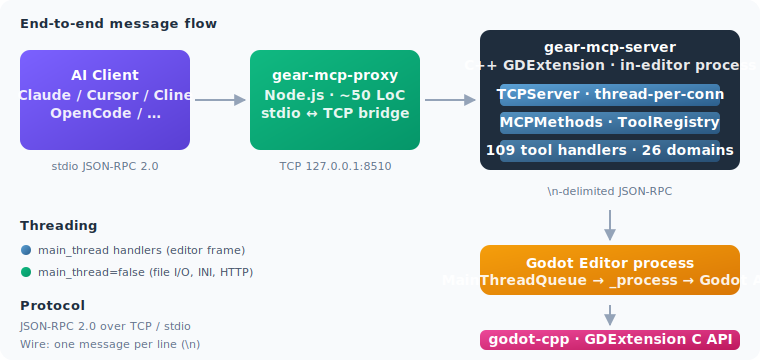
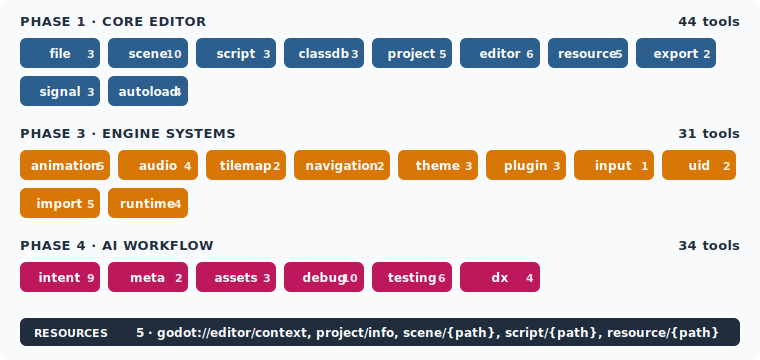

<p align="center">
  <picture>
    <source media="(prefers-color-scheme: dark)" srcset="assets/logo-dark.svg">
    
  </picture>
</p>

<p align="center">
  <strong>中文</strong> · <a href="README.en.md">English</a>
</p>

<p align="center">
  <strong>把 MCP 服务器直接嵌入到 Godot 编辑器进程内部。</strong><br>
  109 个工具 · 5 个资源 · 2 个提示词 —— 适用于 Claude Desktop、Cursor、Cline、OpenCode 以及任何 MCP 客户端。
</p>

<p align="center">
  <a href="#构建"></a>
  <a href="#构建"></a>
  <a href="#构建"></a>
  <a href="LICENSE"></a>
</p>

---

## 这是什么

**Gear MCP Server** 是一个 C++ GDExtension，在 **Godot 编辑器进程内部** 运行一个 MCP 服务器。不需要单独的守护进程，不需要折腾 socket —— 加载插件，打开编辑器，你的 AI 客户端就能通过 109 个类型良好的工具来读取、写入、重构项目。

本仓库发布两个产物：

| 产物                    | 类型                  | 路径                                |
| --------------------- | ------------------- | --------------------------------- |
| `gear-mcp-server`     | GDExtension 动态库     | `project/addons/gear_mcp/bin/` |
| `gear-mcp-proxy`      | npm 包               | `proxy/`                          |

## 架构

<p align="center">
  
</p>

- GDExtension 在 `127.0.0.1:8510` 上开启一个 `TCPServer`（可通过 `GEAR_PORT` 覆盖）。
- 每个客户端连接由独立线程处理；JSON-RPC 2.0 消息以 `\n` 分隔（没有 `Content-Length` 头）。
- 工具 handler 在线程安全的 `ToolRegistry` 中注册。需要访问 Godot 对象的 handler 标记为 `main_thread=true`，并通过 `MainThreadQueue` 分发到编辑器的 `_process` 循环。
- `gear-mcp-proxy` 是一个约 50 行的 Node.js 桥接，将 MCP 客户端的 stdio JSON-RPC 桥接到 TCP socket。以 `npx -y gear-mcp-proxy` 运行（本地路径：`cd proxy && node index.js`）。

## 快速上手

### 1. 编译 GDExtension

```powershell
cmake -S . -B build -DCMAKE_BUILD_TYPE=Debug
cmake --build build --config Debug
```

输出到 `project/addons/gear_mcp/bin/`。文件名格式：
`libgear_mcp_server.{platform}.{variant}.{arch}.{ext}` —— 例如 Windows 上为
`libgear_mcp_server.windows.template_debug.x86_64.dll`。

`GODOTCPP_TARGET`（默认 `template_debug`）控制后缀。`.gdextension` 文件
已列出全部六种变体（`debug`/`release` × `windows`/`linux`/`macos`）。

### 2. 在 Godot 4.4+ 中打开项目

打开 `project/` 目录。GDExtension 会自动加载并启动 TCP 服务器。

### 3. 运行代理并调用工具

```powershell
# 终端 1
cd proxy && node index.js

# 终端 2
echo '{"jsonrpc":"2.0","method":"tools/list","id":1}' | node proxy/index.js
```

代理最多重试 60 秒等待编辑器启动。可通过 `GEAR_HOST` / `GEAR_PORT` 覆盖。

### 4. 接入 MCP 客户端

```json
{
  "mcpServers": {
    "gear": {
      "command": "npx",
      "args": ["-y", "gear-mcp-proxy"]
    }
  }
}
```

## 工具（109 个，跨 26 个域）

<p align="center">
  
</p>

### 文件与项目（16 个工具）

| 域          | 数量  | 亮点                                       |
| ---------- | :-: | ---------------------------------------- |
| `file`     |  3  | 读、写、列举                                 |
| `project`  |  5  | 设置、autoload（只读）、项目信息、版本                  |
| `classdb`  |  3  | 类、属性、方法的内省                              |
| `import`   |  5  | 重新导入、列举、设置、预设                           |

### 场景与世界（18 个工具）

| 域            | 数量  | 亮点                                       |
| ------------ | :-: | ---------------------------------------- |
| `scene`      | 10  | 打开、保存、实例化、运行时挂载，外加 7 个高级操作（节点、属性、信号、组） |
| `runtime`    |  4  | 生成场景实例、设置/读取变量、等待信号                     |
| `tilemap`    |  2  | 设置/读取格子                                  |
| `navigation` |  2  | 地图区域、代理路径                                |

### 代码与调试（13 个工具）

| 域        | 数量  | 亮点                                                  |
| -------- | :-: | --------------------------------------------------- |
| `script` |  3  | 读、写、挂载                                              |
| `debug`  | 10  | LSP：诊断、悬停、补全、定义 · DAP：断点、单步、继续、变量、栈、求值             |

### 编辑器与插件（19 个工具）

| 域          | 数量  | 亮点                          |
| ---------- | :-: | --------------------------- |
| `editor`   |  6  | 选择、撤销/重做、截图、播放、停止、重载       |
| `autoload` |  4  | 添加、删除、列举、注册                 |
| `plugin`   |  3  | 启用、禁用、列举                    |
| `signal`   |  3  | 列举、连接、发射                    |
| `theme`    |  3  | 创建、应用、列举                    |

### 媒体（14 个工具）

| 域           | 数量  | 亮点                          |
| ----------- | :-: | --------------------------- |
| `resource`  |  5  | 加载、保存、列举、检查、创建             |
| `audio`     |  4  | 总线、流播放器、生成音调、监听器           |
| `animation` |  5  | 创建轨道、添加关键帧、设置值、播放、停止       |

### 输入与标识（3 个工具）

| 域       | 数量  | 亮点       |
| ------- | :-: | -------- |
| `input` |  1  | 动作映射     |
| `uid`   |  2  | 生成、解析    |

### 构建与导出（2 个工具）

| 域        | 数量  | 亮点                  |
| -------- | :-: | ------------------- |
| `export` |  2  | 预设、运行（跨平台进程生成）     |

### AI 工作流（24 个工具）

| 域         | 数量  | 亮点                                                  |
| --------- | :-: | --------------------------------------------------- |
| `intent`  |  9  | 快照、决策日志、工作步骤、追踪、录制开关、汇总、交接                       |
| `meta`    |  2  | 工具目录、schema 查询                                     |
| `assets`  |  3  | CC0 素材下载：Poly Haven、AmbientCG、Kenney                  |
| `testing` |  6  | 注入输入、截图、无头运行、日志断言                                 |
| `dx`      |  4  | 项目健康检查、lint、文件索引、符号索引                              |

## 资源与提示词

### 资源（5 个）

| URI                            | 描述                                  |
| ------------------------------ | ----------------------------------- |
| `godot://editor/context`       | 当前选择、正在编辑的场景、帧率                     |
| `godot://project/info`         | 项目名、版本、autoload、设置摘要                 |
| `godot://scene/{path}`         | 实时场景树                               |
| `godot://script/{path}`        | 脚本文本 + 解析诊断                         |
| `godot://resource/{path}`      | 资源文本转储（.tres / .res 元数据）             |

资源 URI 使用模板前缀 —— 服务器会把 `godot://script/res://player.gd` 解析到
匹配的 handler。

### 提示词（2 个）

- `gear:save-intent-snapshot` —— 生成结构化的意图快照
- `gear:summarize-session` —— 从意图状态汇总当前编辑器会话

## 项目结构

```
gear-mcp-server/
├── CMakeLists.txt              # 顶层构建（godot-cpp、nlohmann/json、cpp-httplib、inih，通过 FetchContent）
├── project/                    # Godot 项目（自动加载 GDExtension）
│   └── addons/gear_mcp/
│       ├── gear_mcp.gdextension
│       └── plugin.cfg
├── proxy/                      # Node.js stdio↔TCP 桥接
│   ├── index.js
│   └── package.json
├── src/
│   ├── register_types.cpp      # GDExtension 入口（仅编辑器模式）
│   ├── gear_main_thread_node.* # EditorProcessFrame 桥接
│   ├── godot_api/              # 30+ GDExtension C API 函数指针
│   ├── server/                 # TCPServer、MCPMethods、ToolRegistry、MainThreadQueue
│   ├── shared/                 # type_codec、path_utils、config_parser、json_rpc_client、logger
│   └── tools/                  # 26 个域，每域一个目录
└── tests/                      # Node.js E2E 测试套件（e2e_test、e2e_live_editor、e2e_phase4）
```

## 线程模型

- 标记为 `main_thread=true` 的 handler 在编辑器的 `_process` 中通过 `MainThreadQueue::invoke_on_main` 运行，阻塞 TCP 线程直到编辑器帧完成它们。
- 标记为 `main_thread=false` 的 handler（文件 I/O、INI 解析、资产下载）直接在 TCP 线程上执行。
- 意图状态文件在每次修改时原子重写；访问由递归互斥锁保护。

## 依赖

通过 CMake `FetchContent` 自动拉取，无需手动安装。

| 库                | 版本            | 用途                          |
| ---------------- | ------------- | --------------------------- |
| `godot-cpp`      | git submodule | GDExtension C++ 绑定          |
| `nlohmann/json`  | 3.11.3        | JSON 解析/序列化（唯一的 JSON 库）     |
| `cpp-httplib`    | 0.18.7        | CC0 资产下载的 HTTP 客户端         |
| `inih`           | r58           | `project.godot` INI 解析器     |
| `ws2_32`         | —             | Windows 上的 TCP socket        |

## 许可证

MIT —— 详见 [LICENSE](LICENSE)。
